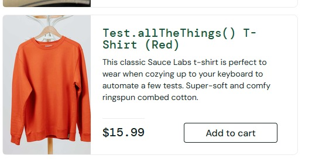

# BUG-001 — Nome do produto exibe texto com aparência de função

## Descrição
Foi identificado que um dos produtos do catálogo apresenta no nome o texto
`Test.allTheThings()`, com aparência de uma função ou trecho de código.

Esse tipo de conteúdo pode causar confusão para o usuário e indica possível
inconsistência nos dados exibidos no catálogo.

## Ambiente
- Aplicação: SauceDemo
- Usuário: standard_user
- Sistema operacional: Windows 11
- Navegador: Firefox 156.0.1
- Data: 29/09/2026

## Pré-condições
- Usuário autenticado na aplicação.
- Catálogo de produtos acessível.

## Passos para reproduzir
1. Acessar o SauceDemo.
2. Realizar login com o usuário `standard_user`.
3. Acessar o catálogo de produtos.
4. Localizar o produto de camiseta vermelha.
5. Observar o nome apresentado para o produto.

## Resultado esperado
O nome do produto deve apresentar apenas uma identificação apropriada e
compreensível para o usuário, sem textos com aparência de código ou função.

## Resultado obtido
O produto é apresentado com o nome:

`Test.allTheThings() T-Shirt (Red)`

## Severidade
Baixa.

## Justificativa da severidade
O problema não impede a navegação, adição ao carrinho ou conclusão da compra,
mas afeta a qualidade e a consistência das informações apresentadas ao usuário.

## Evidência
