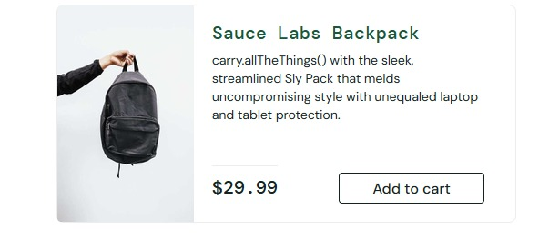

# BUG-002 — Descrição do produto exibe texto com aparência de função

## Descrição
Foi identificado que a descrição do produto `Sauce Labs Backpack` contém o texto
`carry.allTheThings()`, com aparência de uma função ou trecho de código.

Esse tipo de conteúdo pode causar confusão para o usuário e indica possível
inconsistência nas informações apresentadas no catálogo.

## Ambiente
- Aplicação: SauceDemo
- Usuário: standard_user
- Sistema operacional: Windows 11
- Navegador: Firefox 156.0.1
- Data: 29/09/2026

## Pré-condições
- Usuário autenticado na aplicação.
- Catálogo de produtos acessível.

## Passos para reproduzir
1. Acessar o SauceDemo.
2. Realizar login com o usuário `standard_user`.
3. Acessar o catálogo de produtos.
4. Localizar o produto `Sauce Labs Backpack`.
5. Observar a descrição apresentada abaixo do nome do produto.

## Resultado esperado
A descrição do produto deve apresentar apenas informações relacionadas ao item,
em linguagem apropriada e compreensível para o usuário.

## Resultado obtido
A descrição do produto inicia com o texto:

`carry.allTheThings()`

seguido pelo restante da descrição do item.

## Severidade
Baixa.

## Justificativa da severidade
O problema não impede a navegação, adição ao carrinho ou conclusão da compra,
mas afeta a qualidade e a consistência das informações apresentadas ao usuário.

## Evidência
