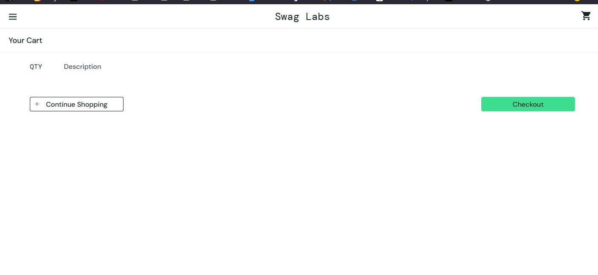

# BUG-003 — Carrinho vazio não apresenta empty state adequado

## Descrição
Ao acessar o carrinho sem nenhum produto adicionado, a área destinada à listagem
dos itens permanece vazia e não apresenta uma mensagem informando claramente
que o carrinho não possui produtos.

A ausência desse feedback pode causar dúvida ao usuário sobre o estado atual do
carrinho.

## Ambiente
- Aplicação: SauceDemo
- Usuário: standard_user
- Sistema operacional: Windows 11
- Navegador: Firefox 156.0.1
- Data: 29/09/2026

## Pré-condições
- Usuário autenticado na aplicação.
- Nenhum produto adicionado ao carrinho.

## Passos para reproduzir
1. Acessar o SauceDemo.
2. Realizar login com o usuário `standard_user`.
3. Não adicionar nenhum produto ao carrinho.
4. Acessar o carrinho através do ícone disponível na aplicação.
5. Observar a área destinada à listagem dos produtos.

## Resultado esperado
A aplicação deve apresentar uma indicação clara de que o carrinho está vazio,
informando ao usuário que não existem produtos adicionados.

## Resultado obtido
A área destinada aos produtos é exibida vazia, sem mensagem ou indicação clara
sobre o estado do carrinho.

## Severidade
Baixa.

## Justificativa da severidade
O problema não impede a utilização da aplicação, mas reduz a clareza da interface
e pode causar dúvida ao usuário sobre se o carrinho está realmente vazio ou se
ocorreu algum problema no carregamento dos itens.

## Evidência
