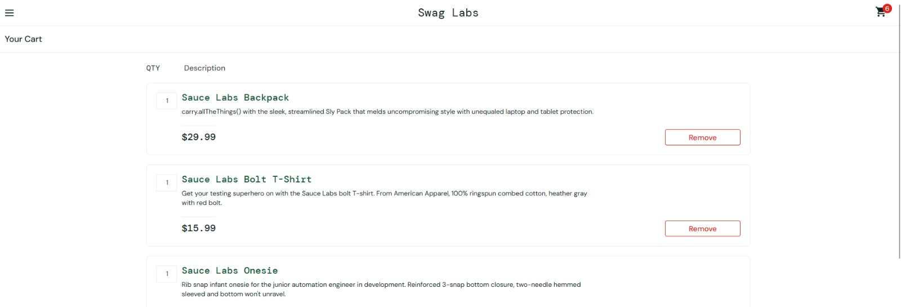

# BUG-004 — Carrinho não permite alterar quantidade e não exibe imagens dos produtos

## Descrição
Ao acessar o carrinho com produtos adicionados, foi observado que os itens são
apresentados sem suas respectivas imagens.

Além disso, a quantidade exibida para cada produto não possui uma opção de edição
direta, sendo possível apenas remover o item do carrinho.

Esses comportamentos reduzem as possibilidades de revisão e gerenciamento dos
produtos antes da conclusão da compra.

## Ambiente
- Aplicação: SauceDemo
- Usuário: standard_user
- Sistema operacional: Windows 11
- Navegador: Firefox 156.0.1
- Data: 29/09/2026

## Pré-condições
- Usuário autenticado na aplicação.
- Um ou mais produtos adicionados ao carrinho.

## Passos para reproduzir
1. Acessar o SauceDemo.
2. Realizar login com o usuário `standard_user`.
3. Adicionar um ou mais produtos ao carrinho.
4. Acessar o carrinho.
5. Observar as informações exibidas para os produtos.
6. Tentar alterar diretamente a quantidade de um dos itens adicionados.

## Resultado esperado
Os produtos devem apresentar informações suficientes para facilitar sua
identificação durante a revisão do carrinho.

Também deve existir uma forma clara de gerenciar a quantidade desejada de cada
produto antes de prosseguir para o checkout.

## Resultado obtido
Os produtos são apresentados sem suas respectivas imagens.

A quantidade é apresentada como um valor fixo e não existe um controle disponível
para alterá-la diretamente. A única ação disponível é a remoção do item.

## Severidade
Média.

## Justificativa da severidade
O comportamento não impede completamente a conclusão da compra, mas afeta uma
etapa importante do fluxo e limita a capacidade do usuário de revisar e ajustar
os produtos antes do checkout.

## Evidência
