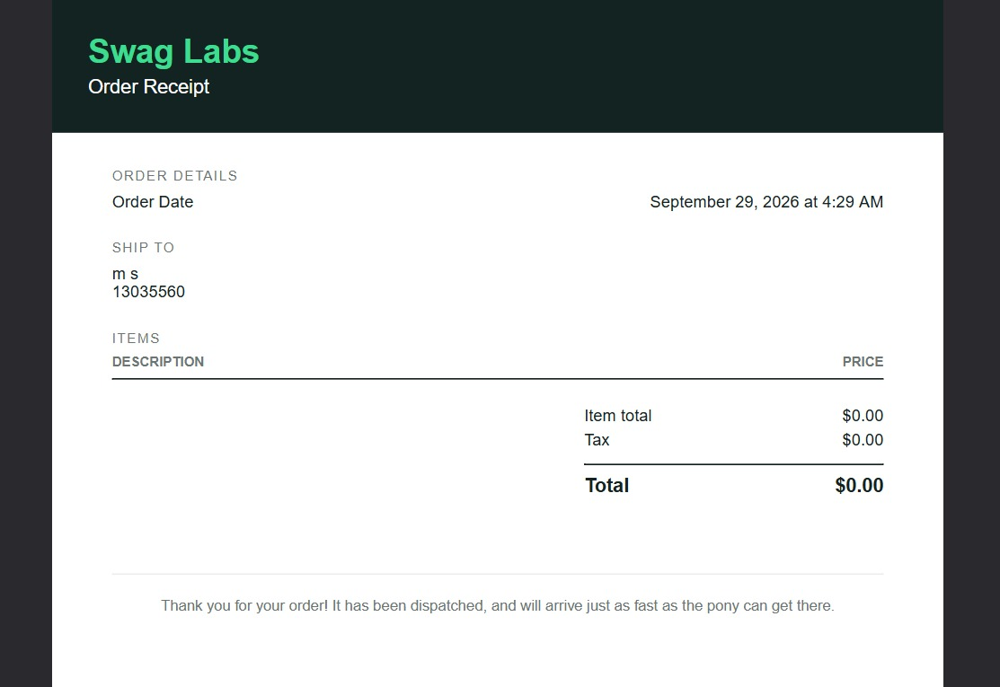

# BUG-005 — Checkout permite finalizar compra sem produtos

## Descrição
A aplicação permite iniciar e concluir o fluxo de checkout mesmo quando o
carrinho não possui nenhum produto.

Após o preenchimento dos dados solicitados, o sistema permite concluir a operação
e gera um pedido com valor total de `$0.00`.

Esse comportamento possibilita a criação de um pedido sem qualquer item associado.

## Ambiente
- Aplicação: SauceDemo
- Usuário: standard_user
- Sistema operacional: Windows 11
- Navegador: Firefox 156.0.1
- Data: 29/09/2026

## Pré-condições
- Usuário autenticado na aplicação.
- Carrinho sem produtos.

## Passos para reproduzir
1. Acessar o SauceDemo.
2. Realizar login com o usuário `standard_user`.
3. Não adicionar nenhum produto ao carrinho.
4. Acessar o carrinho.
5. Selecionar a opção `Checkout`.
6. Preencher os dados solicitados no formulário.
7. Avançar para a próxima etapa.
8. Prosseguir até a conclusão do checkout.
9. Observar o recibo gerado.

## Resultado esperado
O sistema deve impedir o início ou a conclusão do checkout quando não existirem
produtos no carrinho.

O usuário deve receber uma mensagem informando que é necessário adicionar pelo
menos um produto antes de prosseguir com a compra.

## Resultado obtido
O sistema permite concluir todas as etapas do checkout sem produtos adicionados.

Ao final, é gerado um pedido contendo:

- Item total: `$0.00`
- Tax: `$0.00`
- Total: `$0.00`

Além disso, a aplicação apresenta uma mensagem indicando que o pedido foi
concluído.

## Severidade
Alta.

## Justificativa da severidade
O problema afeta diretamente o fluxo principal de compra e permite a criação de
um pedido sem produtos associados.

Esse comportamento pode gerar inconsistências no processo de criação e
processamento dos pedidos, devendo possuir alta prioridade de correção e
regressão.

## Evidência
